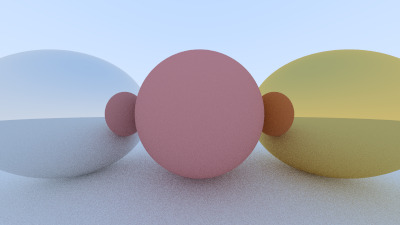

# A Simple Ray Tracer
## Mustafa Bhotvawala

This is meant to be a different take on [Ray Tracing in One Weekend](https://raytracing.github.io/books/RayTracingInOneWeekend.html). The aim is to write a modular, performant application and port it to a GPU. 

# Build Instructions
Create a build/ folder and run cmake .. on it
Run make on Linux/ Build RayTracer.sln on Windows

# Sample

